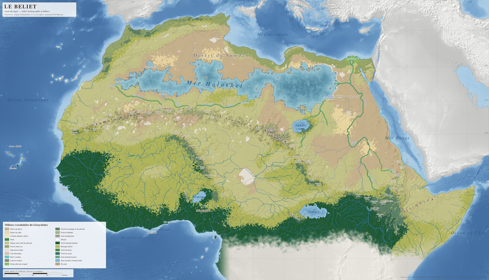

# Le Beliet — carte physique

Carte topographique, des milieux (biomes) et du climat du Beliet, avec les lieux et les routes du corpus, version 0.5.



## Ce que contient ce dépôt

| Dossier / fichier | Contenu | À quoi il sert |
|---|---|---|
| `carte/beliet_carte_milieux.png` | carte des milieux + relief ombré + hydrographie + noms (5 020 × 2 881 px) | regarder, imprimer, partager |
| `carte/beliet_carte_relief.png` | même carte, teintes d'altitude à la place des milieux | regarder le relief |
| `carte/beliet_carte_climat.png` | précipitations annuelles, isohyètes et hivers du \|'Arin (Blanc, Gris, Jaune, Vapeur) | regarder le climat |
| `carte/beliet_carte_milieux.svg`, `_relief.svg`, `_climat.svg` | les trois cartes **en calques** (Inkscape) | retoucher à la main, ajouter des villes |
| `carte/beliet_carte_lieux.png` et `.svg` | **lieux et routes** : 56 cités, 18 zones secondaires, 74 routes tracées sur la géographie, cols empruntés | voir où sont les villes et par où passent les routes |
| `LIEUX_ET_ROUTES.md` | positions et caractéristiques physiques des lieux ; tracé, longueur, durée, altitudes, cols et saisons des routes ; écarts avec le corpus et solutions | valider les placements, corriger LIEUX et ROUTES |
| `carte/beliet_carte_ascii.md` | **carte texte** : relief, eaux, milieux, cols, répertoire des lieux, lieux et routes du corpus, avec coordonnées | corpus, agents, usages sans image |
| `carte/sig/` | données géographiques (GeoJSON, GeoTIFF, cartes d'altitude) | outils SIG (QGIS), Azgaar, futures cartes interactives |
| `donnees/parametres_carte.yaml` | **toutes les décisions de placement** (chaînes, mer, lacs, fleuves, climat) | modifier la géographie |
| `donnees/cols.yaml` | positions calculées des **48 cols** (altitudes du registre) | modifier ou recalculer les cols |
| `donnees/lieux.yaml`, `donnees/routes.yaml` | cible raisonnée et contraintes de chaque lieu ; réglages de tracé des routes | déplacer un lieu, imposer une étape |
| `ANALYSE_COHERENCE.md` | incohérences du corpus et choix retenus | valider ou corriger les choix |
| `ALIGNEMENT_CORPUS.md` | **tout ce que la carte apporte au corpus** : positions, mesures, ajouts, corrections, impossibilités | faire remonter les décisions dans le corpus |
| `carte/sig/beliet_mesures.json` | les mêmes mesures et positions, lisibles par machine | agent de gestion du corpus |
| `references/` | les fichiers de référence fournis (Géosystème, registre, contour, LIEUX, ROUTES, RESSOURCES, illustration) | source |
| `outils/` | le programme qui fabrique la carte | régénérer après modification |

## Regarder la carte

Sur GitHub, cliquez sur `carte/beliet_carte_milieux.png`, puis sur l'image pour l'agrandir. Pour la télécharger, utilisez le bouton « Download raw file » (icône de flèche vers le bas).

## Modifier la carte : trois voies

### 1. Demander à Claude (le plus simple)
Formulez la demande en langage courant. Par exemple : « déplace le lac Akhtir de 200 km vers l'est », « la mer Halakhel doit toucher l'Atlantique », « ajoute la ville X à 12,5° E et 24° N », « place les 48 cols ». Claude modifie `donnees/parametres_carte.yaml`, régénère la carte et enregistre la nouvelle version dans le dépôt. Les versions précédentes restent récupérables.

### 2. Retoucher à la main avec Inkscape (gratuit)
1. Installez Inkscape : https://inkscape.org
2. Téléchargez l'une des trois cartes (`carte/beliet_carte_milieux.svg`, `_relief.svg` ou `_climat.svg`) et ouvrez-la.
3. Ouvrez le panneau des calques (menu Calque → Calques et objets). Vous y trouvez :
   - `01 Relief` ou `02 Milieux` ou `02 Climat` : le fond de carte de ce fichier ;
   - `03 Milieux — polygones éditables` (fichier des milieux) : les biomes en formes modifiables (masqué au départ) ;
   - `03b Hivers du |'Arin` et `03c Isohyètes` (fichier du climat) : faciès d'hiver et courbes de pluie ;
   - `04 Courbes de niveau`, `05 Hydrographie`, `06 Méridiens et parallèles`, `07 Toponymie` ;
   - **`08 Villes et lieux (à compléter)`** : calque vide, prévu pour vos ajouts ;
   - `09 Titre, légende, échelle`.
4. Sélectionnez le calque 08, puis dessinez vos points et écrivez vos noms avec l'outil Texte.
5. Exportez une image : Fichier → Exporter → PNG.

Pour qu'un ajout fait à la main survive à une régénération, signalez-le à Claude, qui l'inscrira dans les paramètres. Une retouche faite seulement dans Inkscape n'existe que dans votre fichier.

### 3. Outils spécialisés (plus tard)
- **QGIS** (SIG gratuit) ouvre `carte/sig/*.geojson` et `carte/sig/*.tif`. C'est l'outil adapté pour gérer des centaines de lieux.
- **Azgaar's Fantasy Map Generator** (navigateur, gratuit) importe `carte/sig/beliet_altitude_azgaar.png` comme carte d'altitude. Azgaar recalcule toutefois ses propres biomes et ses propres fleuves : ils ne suivront pas le Géosystème.

## Repérer une position

La carte est en projection Web Mercator, la même que votre contour d'origine. Les méridiens et parallèles sont tracés tous les 5°. Une position se donne en longitude et latitude, par exemple « 17,8° E, 20,3° N » pour |'Ara-Sukhì. L'échelle est exacte à 15° N ; plus au nord, les distances réelles sont plus courtes que ce que montre la carte.

## Fichiers de `carte/sig/`

| Fichier | Contenu |
|---|---|
| `beliet_geographie.geojson` | mer, lacs, lignes de crête, fleuves nommés, détroits, deltas, 48 cols — chaque objet porte son `geo_id` du registre |
| `beliet_mesures.json` | mesures de la carte, positions de tous les éléments, cols |
| `beliet_cours_eau_secondaires.geojson` | réseau fluvial calculé, avec débit (m³/s) et bassin (km²) |
| `beliet_milieux.geojson` | polygones des milieux (codes du vocabulaire du Géosystème) |
| `beliet_altitude.tif`, `beliet_milieux.tif`, `beliet_pluie_mm.tif` | rasters géoréférencés (EPSG:3857) ; altitude à demi-résolution, pluie au quart |
| `beliet_facies_arin.tif`, `beliet_temperature_hiver.tif` | faciès d'hiver du \|'Arin (codes dans `beliet_climat_codes.json`) ; température moyenne du cœur de l'hiver (°C × 10) |
| `beliet_climat.geojson` | polygones des faciès du \|'Arin et isohyètes |
| `beliet_lieux.geojson`, `beliet_routes.geojson` | lieux (points, caractéristiques physiques) et routes (lignes, mesures) |
| `beliet_lieux_routes.json` | lieux et routes complets : positions, caractéristiques, écarts avec le corpus, tracés, mesures |
| `beliet_altitude_16bits.png` | altitude en niveaux de gris 16 bits (demi-résolution) : valeur = altitude + 10 000 m |
| `beliet_altitude_azgaar.png` | altitude au format attendu par Azgaar |
| `beliet_milieux_codes.json` | correspondance code → milieu → couleur |
| `beliet_statistiques.json` | surfaces, altitudes, surfaces par milieu |

## Régénérer la carte (pour Claude ou un développeur)

```bash
pip install -r outils/requirements.txt
python3 outils/generer_carte.py              # complet, ~9 min
python3 outils/generer_carte.py --reprendre  # réutilise le relief si seuls le climat, les milieux ou l'habillage changent
python3 outils/placer_cols.py                # recalcule les positions des 48 cols (après une génération)
python3 outils/mesures_corpus.py             # met à jour ALIGNEMENT_CORPUS.md §8 et carte/sig/beliet_mesures.json
python3 outils/lieux_routes.py               # place les lieux, trace les routes, carte des lieux, LIEUX_ET_ROUTES.md
python3 outils/carte_ascii.py                # régénère la carte texte (après mesures_corpus.py et lieux_routes.py)
```

Après un changement de relief, relancez dans l'ordre : `generer_carte.py`, `placer_cols.py` (si les chaînes ont bougé), de nouveau `generer_carte.py`, puis `mesures_corpus.py`, `lieux_routes.py` et `carte_ascii.py`.

Le programme télécharge les tuiles d'altitude et les tracés fluviaux réels au premier lancement. Il les garde ensuite dans `outils/cache/` (fichiers non versionnés).

## Sources et licences des données réelles

- **Relief de base :** AWS Terrain Tiles (Mapzen / Linux Foundation). Elles assemblent SRTM, ETOPO1, GMTED et d'autres jeux de données publics.
- **Tracés fluviaux réels :** Natural Earth (domaine public).
- **Altérations, noms et choix :** Géosystème du Beliet v3.1 et son registre.
